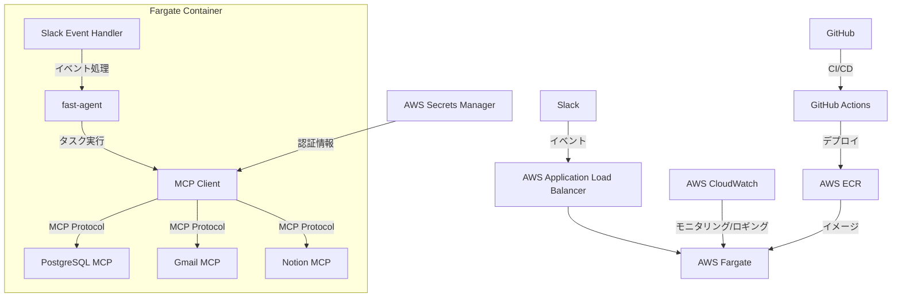
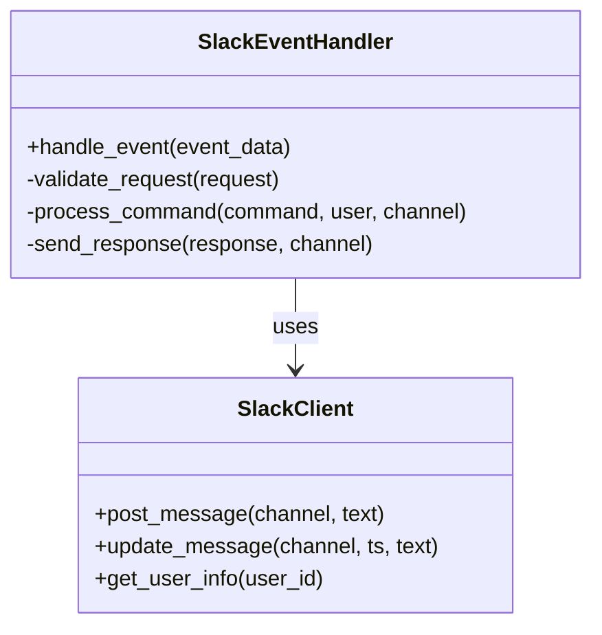
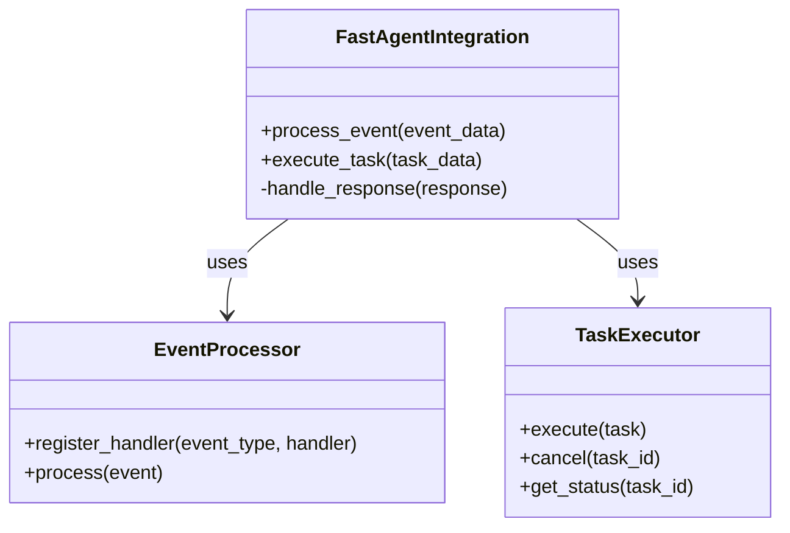
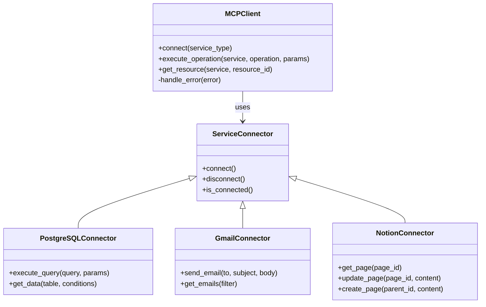
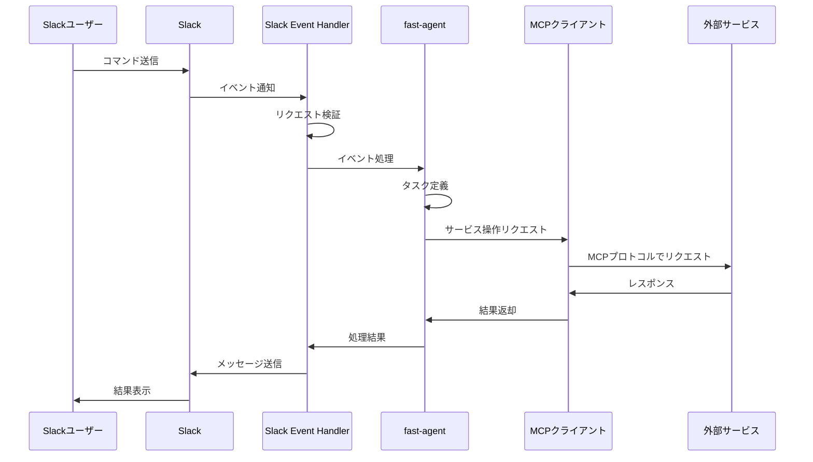
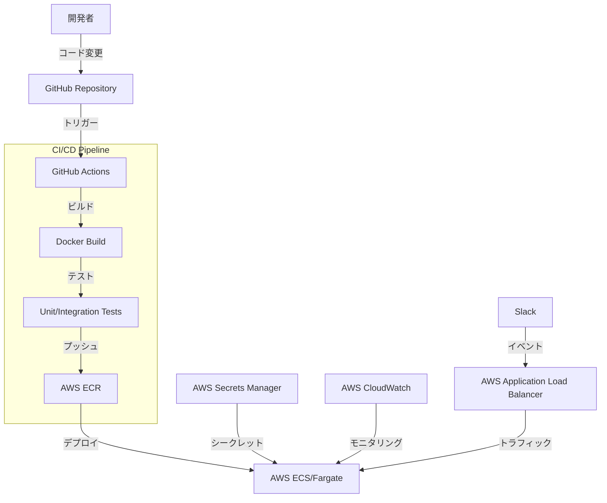

# Slack MCPクライアント アーキテクチャ設計書

## 1. システム概要

このシステムは、Slackからのイベントを受け取り、fast-agentを利用して処理し、MCPプロトコルを通じて外部サービス（PostgreSQL、Gmail、Notion）と連携するクライアントです。AWS Fargate上でコンテナとして実行され、スケーラビリティと管理の容易さを実現します。

## 2. 全体アーキテクチャ

## 3. コンポーネント詳細

### 3.1 Slack Event Handler

- Slackからのイベント（メッセージ、アクション等）を受け取る
- イベントの検証と前処理を行う
- コマンドやアクションを識別し、適切な処理にルーティング
- Slack APIを使用して応答を送信

### 3.2 fast-agent統合

- fast-agentのイベント処理機能を活用
- イベントに基づいてタスクを定義・実行
- 非同期処理とタスク管理
- エラーハンドリングとリトライ機構

### 3.3 MCPクライアント

- MCPプロトコルを実装し、外部サービスと通信
- サービス固有のコネクタを管理
- 認証と認可の処理
- エラーハンドリングとリトライ機構

## 4. データフロー

## 5. デプロイアーキテクチャ

## 6. セキュリティ考慮事項

- **認証情報管理**:
  - AWS SecretsManagerを使用して、Slack APIトークン、外部サービスの認証情報を安全に管理
  - 環境変数経由での認証情報の注入を避け、SecretsManagerからの動的取得を実装

- **アクセス制御**:
  - Slackのチャンネルやユーザーロールに基づくアクセス制御
  - 特定のコマンドや機能へのアクセス制限

- **通信セキュリティ**:
  - すべての外部通信にTLS/SSLを使用
  - AWS内部通信のセキュリティ確保（VPC内での通信など）

- **入力検証**:
  - すべてのユーザー入力の厳格な検証
  - SQLインジェクションやコマンドインジェクションの防止

## 7. 開発ロードマップ

1. **フェーズ1: 基本機能実装**
   - Slack Event Handlerの実装
   - fast-agent統合の基本機能実装
   - 単一のMCPサービス（例：PostgreSQL）との連携実装
   - 基本的なコマンド処理の実装

2. **フェーズ2: 機能拡張**
   - 追加のMCPサービス（Gmail、Notion）との連携実装
   - 高度なコマンド処理とエラーハンドリングの実装
   - ユーザーインターフェースの改善

3. **フェーズ3: デプロイと運用**
   - AWS Fargateへのデプロイパイプラインの構築
   - モニタリングとロギングの設定
   - セキュリティ強化と脆弱性対策

4. **フェーズ4: 最適化と拡張**
   - パフォーマンス最適化
   - 新しいMCPサービスの追加サポート
   - ユーザーフィードバックに基づく改善

## 8. 技術スタック

- **言語**: Python
- **フレームワーク**: 
  - FastAPI（APIエンドポイント用）
  - fast-agent（イベント処理用）
- **コンテナ化**: Docker
- **クラウドサービス**: 
  - AWS Fargate
  - AWS ECR
  - AWS Secrets Manager
  - AWS CloudWatch
- **CI/CD**: GitHub Actions
- **外部サービス連携**:
  - PostgreSQL MCP
  - Gmail MCP
  - Notion MCP
