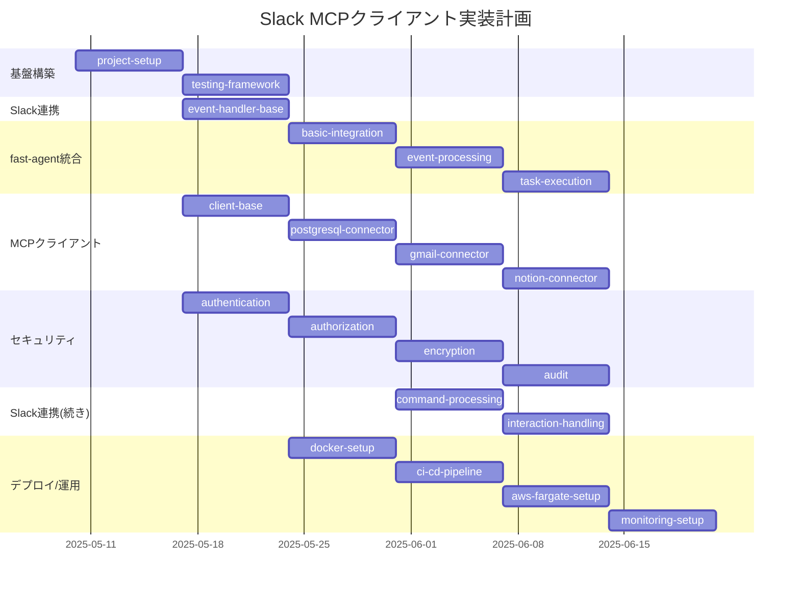

# Slack MCPクライアント 詳細実装計画

## 目次
1. [実装概要](#実装概要)
2. [実装順序と依存関係](#実装順序と依存関係)
3. [memory_bank/foundation（基盤構築）](#1-memory_bankfoundation基盤構築)
4. [memory_bank/slack_integration（Slack連携）](#2-memory_bankslack_integrationslack連携)
5. [memory_bank/fast_agent（fast-agent統合）](#3-memory_bankfast_agentfast-agent統合)
6. [memory_bank/mcp_client（MCPクライアント）](#4-memory_bankmcp_clientmcpクライアント)
7. [memory_bank/security（セキュリティ機能）](#5-memory_banksecurityセキュリティ機能)
8. [memory_bank/deployment（デプロイと運用）](#6-memory_bankdeploymentデプロイと運用)

## 実装概要

このプロジェクトは、Slackからのイベントを受け取り、fast-agentを利用して処理し、MCPプロトコルを通じて外部サービス（PostgreSQL、Gmail、Notion）と連携するクライアントです。AWS Fargate上でコンテナとして実行され、スケーラビリティと管理の容易さを実現します。

実装は以下の6つのmemory_bankに分けて行います：

1. **foundation**: プロジェクトの基盤となる構造と設定
2. **slack_integration**: Slackとの連携機能
3. **fast_agent**: fast-agentとの統合機能
4. **mcp_client**: MCPプロトコルを通じた外部サービスとの連携
5. **security**: セキュリティ関連の機能
6. **deployment**: デプロイと運用に関する設定

各memory_bankは複数のfeatureに分割され、それぞれが約200-300行のコード単位になるように設計されています。

## 実装順序と依存関係



実装の優先順位：

1. 基盤構築（foundation/project-setup）
2. Slack Event Handler基本実装（slack_integration/event-handler-base）
3. fast-agent基本統合（fast_agent/basic-integration）
4. MCPクライアント基本実装（mcp_client/client-base）
5. セキュリティ基本機能（security/authentication）
6. 各コネクタとコマンド処理
7. デプロイと運用の設定

## 1. memory_bank/foundation（基盤構築）

### feature/project-setup
**目的**: プロジェクトの初期設定と基本構造の実装
**タスク**:
- プロジェクトディレクトリ構造の作成
- 依存関係の定義（requirements.txt）
- 基本設定ファイルの作成
- ロギング設定
- 環境変数管理

**実装内容**:
```
project_root/
├── src/
│   ├── __init__.py
│   ├── config.py
│   ├── logging_config.py
│   └── main.py
├── tests/
│   └── __init__.py
├── requirements.txt
├── Dockerfile
├── .env.example
└── README.md
```

**コード例**:
```python
# src/config.py
import os
from dotenv import load_dotenv

load_dotenv()

class Config:
    # アプリケーション設定
    APP_NAME = "slack-mcp-client"
    DEBUG = os.getenv("DEBUG", "False").lower() == "true"
    
    # Slack設定
    SLACK_BOT_TOKEN = os.getenv("SLACK_BOT_TOKEN")
    SLACK_SIGNING_SECRET = os.getenv("SLACK_SIGNING_SECRET")
    
    # AWS設定
    AWS_REGION = os.getenv("AWS_REGION", "ap-northeast-1")
    AWS_SECRET_MANAGER_ENABLED = os.getenv("AWS_SECRET_MANAGER_ENABLED", "False").lower() == "true"
```

### feature/testing-framework
**目的**: テスト基盤の構築
**タスク**:
- ユニットテスト環境の構築
- モックオブジェクトの作成
- テストデータの準備
- CI統合テストの設定

**実装内容**:
```
project_root/
├── tests/
│   ├── __init__.py
│   ├── conftest.py
│   ├── unit/
│   │   ├── __init__.py
│   │   ├── test_slack_handler.py
│   │   ├── test_fast_agent.py
│   │   └── test_mcp_client.py
│   └── integration/
│       ├── __init__.py
│       └── test_end_to_end.py
└── .github/
    └── workflows/
        └── tests.yml
```

**コード例**:
```python
# tests/conftest.py
import pytest
from unittest.mock import MagicMock

@pytest.fixture
def mock_slack_client():
    client = MagicMock()
    client.post_message.return_value = {"ok": True}
    return client

@pytest.fixture
def mock_fast_agent():
    agent = MagicMock()
    agent.process_event.return_value = {"status": "success"}
    return agent
```

## 2. memory_bank/slack_integration（Slack連携）

### feature/event-handler-base
**目的**: Slack Event Handlerの基本実装
**タスク**:
- Slackイベント受信エンドポイントの実装
- イベント検証機能の実装
- 基本的なイベントルーティング
- エラーハンドリング

**実装内容**:
```
project_root/
└── src/
    └── slack/
        ├── __init__.py
        ├── event_handler.py
        ├── verification.py
        └── exceptions.py
```

**コード例**:
```python
# src/slack/event_handler.py
from fastapi import FastAPI, Request, HTTPException
from .verification import verify_slack_request

app = FastAPI()

class SlackEventHandler:
    def __init__(self, config):
        self.config = config
        self.signing_secret = config.SLACK_SIGNING_SECRET
    
    async def handle_event(self, request: Request):
        # リクエスト検証
        body = await request.body()
        if not verify_slack_request(request.headers, body, self.signing_secret):
            raise HTTPException(status_code=401, detail="Invalid request signature")
        
        # イベントデータの解析
        event_data = await request.json()
        
        # イベントタイプに基づく処理
        event_type = event_data.get("type")
        if event_type == "url_verification":
            return {"challenge": event_data.get("challenge")}
        
        # その他のイベント処理
        return {"status": "received"}
```

### feature/command-processing
**目的**: Slackコマンド処理機能の実装
**タスク**:
- スラッシュコマンド処理の実装
- コマンドパーサーの実装
- ヘルプコマンドの実装
- 基本的なレスポンス機能

**実装内容**:
```
project_root/
└── src/
    └── slack/
        ├── commands/
        │   ├── __init__.py
        │   ├── command_processor.py
        │   ├── parser.py
        │   └── handlers/
        │       ├── __init__.py
        │       ├── help_handler.py
        │       └── base_handler.py
        └── client.py
```

**コード例**:
```python
# src/slack/commands/command_processor.py
class CommandProcessor:
    def __init__(self, slack_client):
        self.slack_client = slack_client
        self.handlers = {}
    
    def register_handler(self, command, handler):
        self.handlers[command] = handler
    
    def process_command(self, command, user, channel, text):
        # コマンド解析
        args = self.parse_arguments(text)
        
        # ハンドラー取得
        handler = self.handlers.get(command)
        if not handler:
            return self.send_error_response(channel, f"Unknown command: {command}")
        
        # コマンド実行
        response = handler.handle(user, channel, args)
        
        # レスポンス送信
        return self.slack_client.post_message(channel, response)
    
    def parse_arguments(self, text):
        # 引数解析ロジック
        if not text:
            return []
        return text.split()
```

### feature/interaction-handling
**目的**: Slackインタラクション処理の実装
**タスク**:
- ボタンクリックなどのインタラクション処理
- モーダルダイアログの実装
- メッセージアクションの処理

**実装内容**:
```
project_root/
└── src/
    └── slack/
        ├── interactions/
        │   ├── __init__.py
        │   ├── interaction_handler.py
        │   └── handlers/
        │       ├── __init__.py
        │       ├── button_handler.py
        │       └── modal_handler.py
        └── views/
            ├── __init__.py
            └── modal_builder.py
```

**コード例**:
```python
# src/slack/interactions/interaction_handler.py
class InteractionHandler:
    def __init__(self, slack_client):
        self.slack_client = slack_client
        self.handlers = {}
    
    def register_handler(self, action_id, handler):
        self.handlers[action_id] = handler
    
    def handle_interaction(self, interaction_data):
        # インタラクションタイプの判別
        interaction_type = interaction_data.get("type")
        
        if interaction_type == "block_actions":
            return self.handle_block_actions(interaction_data)
        elif interaction_type == "view_submission":
            return self.handle_view_submission(interaction_data)
        
        return {"text": "Unsupported interaction type"}
    
    def handle_block_actions(self, interaction_data):
        # ブロックアクションの処理
        actions = interaction_data.get("actions", [])
        for action in actions:
            action_id = action.get("action_id")
            handler = self.handlers.get(action_id)
            if handler:
                return handler.handle(interaction_data, action)
        
        return {"text": "No handler found for this action"}
```

## 3. memory_bank/fast_agent（fast-agent統合）

### feature/basic-integration
**目的**: fast-agent基本統合の実装
**タスク**:
- fast-agentライブラリの統合
- 基本的な設定と初期化
- エラーハンドリング基盤

**実装内容**:
```
project_root/
└── src/
    └── agent/
        ├── __init__.py
        ├── integration.py
        ├── config.py
        └── exceptions.py
```

**コード例**:
```python
# src/agent/integration.py
from fast_agent import Agent, AgentConfig

class FastAgentIntegration:
    def __init__(self, config):
        self.config = config
        self.agent_config = AgentConfig(
            api_key=config.FAST_AGENT_API_KEY,
            timeout=config.FAST_AGENT_TIMEOUT
        )
        self.agent = None
    
    def initialize(self):
        try:
            self.agent = Agent(self.agent_config)
            return True
        except Exception as e:
            # エラーハンドリング
            return False
    
    def process_event(self, event_data):
        if not self.agent:
            raise Exception("Agent not initialized")
        
        try:
            return self.agent.process_event(event_data)
        except Exception as e:
            # エラーハンドリング
            return {"error": str(e)}
```

### feature/event-processing
**目的**: イベント処理機能の実装
**タスク**:
- イベントプロセッサーの実装
- イベントハンドラー登録機能
- イベントルーティング

**実装内容**:
```
project_root/
└── src/
    └── agent/
        ├── events/
        │   ├── __init__.py
        │   ├── event_processor.py
        │   └── handlers/
        │       ├── __init__.py
        │       └── base_handler.py
        └── models/
            ├── __init__.py
            └── event.py
```

**コード例**:
```python
# src/agent/events/event_processor.py
class EventProcessor:
    def __init__(self):
        self.handlers = {}
    
    def register_handler(self, event_type, handler):
        if event_type not in self.handlers:
            self.handlers[event_type] = []
        self.handlers[event_type].append(handler)
    
    def process(self, event):
        event_type = event.get("type")
        
        # イベントタイプに対応するハンドラーを取得
        handlers = self.handlers.get(event_type, [])
        
        results = []
        for handler in handlers:
            try:
                result = handler.handle(event)
                results.append(result)
            except Exception as e:
                # エラーハンドリング
                results.append({"error": str(e)})
        
        return results
```

### feature/task-execution
**目的**: タスク実行機能の実装
**タスク**:
- タスク実行エンジンの実装
- 非同期タスク処理
- タスクステータス管理
- タスクキャンセル機能

**実装内容**:
```
project_root/
└── src/
    └── agent/
        ├── tasks/
        │   ├── __init__.py
        │   ├── task_executor.py
        │   ├── task_manager.py
        │   └── models/
        │       ├── __init__.py
        │       └── task.py
        └── utils/
            ├── __init__.py
            └── async_helper.py
```

**コード例**:
```python
# src/agent/tasks/task_executor.py
import asyncio
import uuid
from datetime import datetime

class TaskExecutor:
    def __init__(self):
        self.tasks = {}
    
    async def execute(self, task):
        task_id = str(uuid.uuid4())
        
        # タスク情報の初期化
        self.tasks[task_id] = {
            "id": task_id,
            "status": "running",
            "created_at": datetime.now(),
            "updated_at": datetime.now(),
            "result": None,
            "error": None
        }
        
        # 非同期タスク実行
        asyncio.create_task(self._run_task(task_id, task))
        
        return {"task_id": task_id}
    
    async def _run_task(self, task_id, task):
        try:
            result = await task.run()
            self.tasks[task_id]["status"] = "completed"
            self.tasks[task_id]["result"] = result
        except Exception as e:
            self.tasks[task_id]["status"] = "failed"
            self.tasks[task_id]["error"] = str(e)
        finally:
            self.tasks[task_id]["updated_at"] = datetime.now()
    
    def cancel(self, task_id):
        if task_id not in self.tasks:
            return {"error": "Task not found"}
        
        if self.tasks[task_id]["status"] == "running":
            self.tasks[task_id]["status"] = "cancelled"
            self.tasks[task_id]["updated_at"] = datetime.now()
            return {"status": "cancelled"}
        
        return {"error": "Task cannot be cancelled"}
    
    def get_status(self, task_id):
        if task_id not in self.tasks:
            return {"error": "Task not found"}
        
        return self.tasks[task_id]
```

## 4. memory_bank/mcp_client（MCPクライアント）

### feature/client-base
**目的**: MCPクライアント基本実装
**タスク**:
- MCPプロトコル基本実装
- サービスコネクタ基盤
- エラーハンドリング

**実装内容**:
```
project_root/
└── src/
    └── mcp/
        ├── __init__.py
        ├── client.py
        ├── protocol.py
        ├── connector.py
        └── exceptions.py
```

**コード例**:
```python
# src/mcp/client.py
class MCPClient:
    def __init__(self, config):
        self.config = config
        self.connectors = {}
    
    def register_connector(self, service_type, connector):
        self.connectors[service_type] = connector
    
    def connect(self, service_type):
        if service_type not in self.connectors:
            raise ValueError(f"No connector registered for service: {service_type}")
        
        connector = self.connectors[service_type]
        return connector.connect()
    
    def execute_operation(self, service, operation, params):
        if service not in self.connectors:
            raise ValueError(f"No connector registered for service: {service}")
        
        connector = self.connectors[service]
        if not connector.is_connected():
            connector.connect()
        
        return connector.execute_operation(operation, params)
    
    def get_resource(self, service, resource_id):
        if service not in self.connectors:
            raise ValueError(f"No connector registered for service: {service}")
        
        connector = self.connectors[service]
        if not connector.is_connected():
            connector.connect()
        
        return connector.get_resource(resource_id)
```

### feature/postgresql-connector
**目的**: PostgreSQL連携の実装
**タスク**:
- PostgreSQLコネクタの実装
- クエリ実行機能
- データ取得・更新機能
- トランザクション管理

**実装内容**:
```
project_root/
└── src/
    └── mcp/
        └── connectors/
            ├── __init__.py
            ├── postgresql/
            │   ├── __init__.py
            │   ├── connector.py
            │   ├── query_builder.py
            │   └── transaction.py
            └── models/
                ├── __init__.py
                └── query_result.py
```

**コード例**:
```python
# src/mcp/connectors/postgresql/connector.py
import psycopg2
from ...connector import ServiceConnector

class PostgreSQLConnector(ServiceConnector):
    def __init__(self, config):
        self.config = config
        self.connection = None
    
    def connect(self):
        try:
            self.connection = psycopg2.connect(
                host=self.config.PG_HOST,
                port=self.config.PG_PORT,
                database=self.config.PG_DATABASE,
                user=self.config.PG_USER,
                password=self.config.PG_PASSWORD
            )
            return True
        except Exception as e:
            # エラーハンドリング
            return False
    
    def disconnect(self):
        if self.connection:
            self.connection.close()
            self.connection = None
    
    def is_connected(self):
        return self.connection is not None and not self.connection.closed
    
    def execute_query(self, query, params=None):
        if not self.is_connected():
            self.connect()
        
        cursor = self.connection.cursor()
        try:
            cursor.execute(query, params or {})
            self.connection.commit()
            
            if cursor.description:
                columns = [desc[0] for desc in cursor.description]
                results = cursor.fetchall()
                return {"columns": columns, "rows": results}
            
            return {"affected_rows": cursor.rowcount}
        except Exception as e:
            self.connection.rollback()
            raise e
        finally:
            cursor.close()
```

### feature/gmail-connector
**目的**: Gmail連携の実装
**タスク**:
- Gmailコネクタの実装
- メール送信機能
- メール取得機能
- 添付ファイル処理

**実装内容**:
```
project_root/
└── src/
    └── mcp/
        └── connectors/
            ├── gmail/
            │   ├── __init__.py
            │   ├── connector.py
            │   ├── auth.py
            │   └── models/
            │       ├── __init__.py
            │       ├── email.py
            │       └── attachment.py
            └── utils/
                ├── __init__.py
                └── mime_helper.py
```

**コード例**:
```python
# src/mcp/connectors/gmail/connector.py
from googleapiclient.discovery import build
from ...connector import ServiceConnector
from .auth import get_credentials

class GmailConnector(ServiceConnector):
    def __init__(self, config):
        self.config = config
        self.service = None
    
    def connect(self):
        try:
            credentials = get_credentials(self.config)
            self.service = build('gmail', 'v1', credentials=credentials)
            return True
        except Exception as e:
            # エラーハンドリング
            return False
    
    def disconnect(self):
        self.service = None
    
    def is_connected(self):
        return self.service is not None
    
    def send_email(self, to, subject, body, attachments=None):
        if not self.is_connected():
            self.connect()
        
        # メール作成ロジック
        message = self._create_message(to, subject, body, attachments)
        
        # メール送信
        try:
            result = self.service.users().messages().send(
                userId='me',
                body=message
            ).execute()
            return {"message_id": result.get('id')}
        except Exception as e:
            # エラーハンドリング
            raise e
    
    def get_emails(self, query=None, max_results=10):
        if not self.is_connected():
            self.connect()
        
        try:
            results = self.service.users().messages().list(
                userId='me',
                q=query,
                maxResults=max_results
            ).execute()
            
            messages = results.get('messages', [])
            emails = []
            
            for message in messages:
                msg = self.service.users().messages().get(
                    userId='me',
                    id=message['id']
                ).execute()
                emails.append(self._parse_message(msg))
            
            return emails
        except Exception as e:
            # エラーハンドリング
            raise e
```

### feature/notion-connector
**目的**: Notion連携の実装
**タスク**:
- Notionコネクタの実装
- ページ取得・更新機能
- ページ作成機能
- データベース操作機能

**実装内容**:
```
project_root/
└── src/
    └── mcp/
        └── connectors/
            ├── notion/
            │   ├── __init__.py
            │   ├── connector.py
            │   ├── page_handler.py
            │   └── database_handler.py
            └── models/
                ├── __init__.py
                └── notion_page.py
```

**コード例**:
```python
# src/mcp/connectors/notion/connector.py
import requests
from ...connector import ServiceConnector

class NotionConnector(ServiceConnector):
    API_BASE_URL = "https://api.notion.com/v1"
    
    def __init__(self, config):
        self.config = config
        self.token = config.NOTION_TOKEN
        self.headers = None
    
    def connect(self):
        try:
            self.headers = {
                "Authorization": f"Bearer {self.token}",
                "Notion-Version": "2022-06-28",
                "Content-Type": "application/json"
            }
            
            # 接続テスト
            response = requests.get(
                f"{self.API_BASE_URL}/users/me",
                headers=self.headers
            )
            response.raise_for_status()
            
            return True
        except Exception as e:
            # エラーハンドリング
            return False
    
    def disconnect(self):
        self.headers = None
    
    def is_connected(self):
        return self.headers is not None
    
    def get_page(self, page_id):
        if not self.is_connected():
            self.connect()
        
        try:
            response = requests.get(
                f"{self.API_BASE_URL}/pages/{page_id}",
                headers=self.headers
            )
            response.raise_for_status()
            
            return response.json()
        except Exception as e:
            # エラーハンドリング
            raise e
    
    def update_page(self, page_id, content):
        if not self.is_connected():
            self.connect()
        
        try:
            response = requests.patch(
                f"{self.API_BASE_URL}/pages/{page_id}",
                headers=self.headers,
                json=content
            )
            response.raise_for_status()
            
            return response.json()
        except Exception as e:
            # エラーハンドリング
            raise e
    
    def create_page(self, parent_id, content):
        if not self.is_connected():
            self.connect()
        
        try:
            response = requests.post(
                f"{self.API_BASE_URL}/pages",
                headers=self.headers,
                json={
                    "parent": {"page_id": parent_id},
                    "properties": content
                }
            )
            response.raise_for_status()
            
            return response.json()
        except Exception as e:
            # エラーハンドリング
            raise e
```

## 5. memory_bank/security（セキュリティ機能）

### feature/authentication
**目的**: 認証機能の実装
**タスク**:
- Slack認証の実装
- 外部サービスの認証情報管理
- AWS Secrets Managerとの連携

**実装内容**:
```
project_root/
└── src/
    └── security/
        ├── __init__.py
        ├── authentication/
        │   ├── __init__.py
        │   ├── slack_auth.py
        │   └── service_auth.py
        └── secrets/
            ├── __init__.py
            └── secrets_manager.py
```

**コード例**:
```python
# src/security/secrets/secrets_manager.py
import boto3
import json

class SecretsManager:
    def __init__(self, config):
        self.config = config
        self.client = boto3.client(
            'secretsmanager',
            region_name=config.AWS_REGION
        )
    
    def get_secret(self, secret_name):
        try:
            response = self.client.get_secret_value(
                SecretId=secret_name
            )
            
            if 'SecretString' in response:
                return json.loads(response['SecretString'])
            else:
                # バイナリシークレットの場合
                return response['SecretBinary']
        except Exception as e:
            # エラーハンドリング
            raise e
    
    def update_secret(self, secret_name, secret_value):
        try:
            self.client.update_secret(
                SecretId=secret_name,
                SecretString=json.dumps(secret_value)
            )
            return True
        except Exception as e:
            # エラーハンドリング
            raise e
```

### feature/authorization
**目的**: 認可機能の実装
**タスク**:
- アクセス制御の実装
- 権限管理
- ロールベースのアクセス制御

**実装内容**:
```
project_root/
└── src/
    └── security/
        └── authorization/
            ├── __init__.py
            ├── access_control.py
            ├── permission.py
            └── role.py
```

**コード例**:
```python
# src/security/authorization/access_control.py
class AccessControl:
    def __init__(self):
        self.roles = {}
        self.user_roles = {}
    
    def add_role(self, role_name, permissions):
        self.roles[role_name] = permissions
    
    def assign_role(self, user_id, role_name):
        if role_name not in self.roles:
            raise ValueError(f"Role does not exist: {role_name}")
        
        if user_id not in self.user_roles:
            self.user_roles[user_id] = []
        
        if role_name not in self.user_roles[user_id]:
            self.user_roles[user_id].append(role_name)
    
    def has_permission(self, user_id, permission):
        if user_id not in self.user_roles:
            return False
        
        user_roles = self.user_roles[user_id]
        for role in user_roles:
            if role not in self.roles:
                continue
            
            if permission in self.roles[role]:
                return True
        
        return False
```

### feature/encryption
**目的**: 暗号化機能の実装
**タスク**:
- 通信の暗号化
- データの暗号化
- 鍵管理

**実装内容**:
```
project_root/
└── src/
    └── security/
        └── encryption/
            ├── __init__.py
            ├── data_encryption.py
            └── key_manager.py
```

**コード例**:
```python
# src/security/encryption/data_encryption.py
from cryptography.fernet import Fernet

class DataEncryption:
    def __init__(self, key=None):
        self.key = key or Fernet.generate_key()
        self.cipher = Fernet(self.key)
    
    def encrypt(self, data):
        if isinstance(data, str):
            data = data.encode()
        
        return self.cipher.encrypt(data)
    
    def decrypt(self, encrypted_data):
        return self.cipher.decrypt(encrypted_data)
    
    def get_key(self):
        return self.key
```

### feature/audit
**目的**: 監査機能の実装
**タスク**:
- 操作ログの記録
- 監査証跡の管理
- コンプライアンス対応

**実装内容**:
```
project_root/
└── src/
    └── security/
        └── audit/
            ├── __init__.py
            ├── audit_logger.py
            └── models/
                ├── __init__.py
                └── audit_event.py
```

**コード例**:
```python
# src/security/audit/audit_logger.py
import logging
import json
from datetime import datetime

class AuditLogger:
    def __init__(self, config):
        self.config = config
        self.logger = logging.getLogger("audit")
        
        # ロガー設定
        handler = logging.FileHandler(config.AUDIT_LOG_FILE)
        formatter = logging.Formatter('%(asctime)s - %(message)s')
        handler.setFormatter(formatter)
        self.logger.addHandler(handler)
        self.logger.setLevel(logging.INFO)
    
    def log_event(self, event_type, user_id, resource, action, status, details=None):
        event = {
            "timestamp": datetime.now().isoformat(),
            "event_type": event_type,
            "user_id": user_id,
            "resource": resource,
            "action": action,
            "status": status,
            "details": details or {}
        }
        
        self.logger.info(json.dumps(event))
        return event
```

## 6. memory_bank/deployment（デプロイと運用）

### feature/docker-setup
**目的**: Docker化の実装
**タスク**:
- Dockerfileの作成
- docker-composeの設定
- 開発環境と本番環境の分離

**実装内容**:
```
project_root/
├── Dockerfile
├── docker-compose.yml
└── docker/
    ├── dev.Dockerfile
    └── prod.Dockerfile
```

**コード例**:
```dockerfile
# Dockerfile
FROM python:3.9-slim

WORKDIR /app

COPY requirements.txt .
RUN pip install --no-cache-dir -r requirements.txt

COPY . .

CMD ["uvicorn", "src.main:app", "--host", "0.0.0.0", "--port", "8000"]
```

```yaml
# docker-compose.yml
version: '3'

services:
  app:
    build: .
    ports:
      - "8000:8000"
    environment:
      - DEBUG=true
      - AWS_REGION=ap-northeast-1
    volumes:
      - ./:/app
    depends_on:
      - postgres
  
  postgres:
    image: postgres:13
    environment:
      - POSTGRES_USER=postgres
      - POSTGRES_PASSWORD=postgres
      - POSTGRES_DB=mcp_client
    ports:
      - "5432:5432"
    volumes:
      - postgres_data:/var/lib/postgresql/data

volumes:
  postgres_data:
```

### feature/ci-cd-pipeline
**目的**: CI/CDパイプラインの構築
**タスク**:
- GitHub Actionsワークフローの実装
- ビルド・テスト自動化
- ECRへのイメージプッシュ設定

**実装内容**:
```
project_root/
└── .github/
    └── workflows/
        ├── build.yml
        ├── test.yml
        └── deploy.yml
```

**コード例**:
```yaml
# .github/workflows/build.yml
name: Build and Test

on:
  push:
    branches: [ main, develop ]
  pull_request:
    branches: [ main, develop ]

jobs:
  build:
    runs-on: ubuntu-latest
    
    steps:
    - uses: actions/checkout@v2
    
    - name: Set up Python
      uses: actions/setup-python@v2
      with:
        python-version: '3.9'
    
    - name: Install dependencies
      run: |
        python -m pip install --upgrade pip
        if [ -f requirements.txt ]; then pip install -r requirements.txt; fi
        pip install pytest pytest-cov
    
    - name: Test with pytest
      run: |
        pytest --cov=src tests/
    
    - name: Build Docker image
      run: |
        docker build -t slack-mcp-client .
```

### feature/aws-fargate-setup
**目的**: AWS Fargate設定の実装
**タスク**:
- ECSタスク定義の作成
- Fargateサービス設定
- ALB設定
- セキュリティグループ設定

**実装内容**:
```
project_root/
└── infrastructure/
    ├── ecs-task-definition.json
    ├── fargate-service.json
    └── alb-config.json
```

**コード例**:
```json
// infrastructure/ecs-task-definition.json
{
  "family": "slack-mcp-client",
  "networkMode": "awsvpc",
  "executionRoleArn": "arn:aws:iam::123456789012:role/ecsTaskExecutionRole",
  "containerDefinitions": [
    {
      "name": "slack-mcp-client",
      "image": "123456789012.dkr.ecr.ap-northeast-1.amazonaws.com/slack-mcp-client:latest",
      "essential": true,
      "portMappings": [
        {
          "containerPort": 8000,
          "hostPort": 8000,
          "protocol": "tcp"
        }
      ],
      "logConfiguration": {
        "logDriver": "awslogs",
        "options": {
          "awslogs-group": "/ecs/slack-mcp-client",
          "awslogs-region": "ap-northeast-1",
          "awslogs-stream-prefix": "ecs"
        }
      },
      "secrets": [
        {
          "name": "SLACK_BOT_TOKEN",
          "valueFrom": "arn:aws:secretsmanager:ap-northeast-1:123456789012:secret:slack-mcp-client/slack-bot-token"
        },
        {
          "name": "SLACK_SIGNING_SECRET",
          "valueFrom": "arn:aws:secretsmanager:ap-northeast-1:123456789012:secret:slack-mcp-client/slack-signing-secret"
        }
      ]
    }
  ],
  "requiresCompatibilities": [
    "FARGATE"
  ],
  "cpu": "256",
  "memory": "512"
}
```

### feature/monitoring-setup
**目的**: モニタリング設定の実装
**タスク**:
- CloudWatchログ設定
- アラート設定
- ダッシュボード作成
- ヘルスチェック実装

**実装内容**:
```
project_root/
└── infrastructure/
    ├── cloudwatch-logs.json
    ├── cloudwatch-alarms.json
    └── monitoring-dashboard.json
```

**コード例**:
```json
// infrastructure/cloudwatch-alarms.json
{
  "alarms": [
    {
      "name": "slack-mcp-client-cpu-utilization",
      "namespace": "AWS/ECS",
      "metricName": "CPUUtilization",
      "dimensions": [
        {
          "name": "ClusterName",
          "value": "slack-mcp-client-cluster"
        },
        {
          "name": "ServiceName",
          "value": "slack-mcp-client-service"
        }
      ],
      "statistic": "Average",
      "period": 60,
      "evaluationPeriods": 5,
      "threshold": 80,
      "comparisonOperator": "GreaterThanThreshold",
      "alarmActions": [
        "arn:aws:sns:ap-northeast-1:123456789012:slack-mcp-client-alerts"
      ]
    },
    {
      "name": "slack-mcp-client-memory-utilization",
      "namespace": "AWS/ECS",
      "metricName": "MemoryUtilization",
      "dimensions": [
        {
          "name": "ClusterName",
          "value": "slack-mcp-client-cluster"
        },
        {
          "name": "ServiceName",
          "value": "slack-mcp-client-service"
        }
      ],
      "statistic": "Average",
      "period": 60,
      "evaluationPeriods": 5,
      "threshold": 80,
      "comparisonOperator": "GreaterThanThreshold",
      "alarmActions": [
        "arn:aws:sns:ap-northeast-1:123456789012:slack-mcp-client-alerts"
      ]
    }
  ]
}
```

## まとめと次のステップ

この実装計画では、Slack MCPクライアントの各コンポーネントを6つのmemory_bankに分け、それぞれを複数のfeatureに分割しました。各featureは約200-300行のコード単位になるように設計されています。

### 実装の進め方

1. まず基盤となる構造（foundation）を実装し、プロジェクトの土台を作ります。
2. 次にSlack Event Handlerの基本実装を行い、Slackからのイベントを受け取れるようにします。
3. fast-agent基本統合を実装し、イベント処理の基盤を構築します。
4. MCPクライアント基本実装とセキュリティ基本機能を並行して進めます。
5. 各コネクタとコマンド処理機能を実装し、外部サービスとの連携を可能にします。
6. 最後にデプロイと運用の設定を行い、AWS Fargateでの運用を可能にします。

### 開発環境の準備

開発を始める前に、以下の環境を準備します：

1. Python 3.9以上の開発環境
2. Docker Desktop（ローカルでのコンテナ開発用）
3. AWS CLI（AWSリソースの操作用）
4. Slack APIアクセス用のトークンとシークレット
5. 各外部サービス（PostgreSQL、Gmail、Notion）のAPIキーまたは認証情報

### テスト戦略

各featureの実装と並行してテストを作成し、継続的に品質を確保します：

1. ユニットテスト：各クラスとメソッドの機能テスト
2. 統合テスト：コンポーネント間の連携テスト
3. E2Eテスト：Slackからのイベント受信から外部サービス連携までの一連のフロー

### 今後の拡張性

この設計は将来的な拡張を考慮しています：

1. 新しいMCPサービスの追加が容易
2. コマンドやインタラクションの追加が簡単
3. スケーリングに対応した構造

以上の実装計画に基づいて開発を進めることで、堅牢で拡張性の高いSlack MCPクライアントを構築できます。
